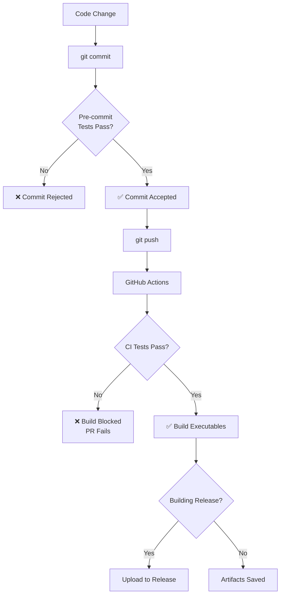

# Testing & Release Process

## Automated Testing

This project uses **Jest** for unit testing and has automated checks to ensure code quality before builds and releases.

### Running Tests

```bash
# Run all tests
npm test

# Run tests in watch mode (for development)
npm run test:watch

# Generate coverage report
npm run test:coverage
```

### Test Protection Mechanisms

#### 1. **Pre-Build Testing** (Local)
Tests automatically run before any build command:

```bash
npm run build      # Tests run first, build aborts if tests fail
npm run build:exe  # Tests run first, build aborts if tests fail
```

If tests fail, the build will be aborted with an error message.

#### 2. **Pre-Commit Hook** (Local)
Git commits are protected by a pre-commit hook that runs tests:

```bash
git commit -m "message"  # Tests run automatically before commit
```

If tests fail, the commit will be rejected. You can bypass this (not recommended) with:
```bash
git commit --no-verify -m "message"  # Skip pre-commit hook
```

#### 3. **GitHub Actions CI/CD** (Remote)
Every push and pull request triggers automated testing on GitHub:

- **On Push/PR**: Tests run automatically
- **On Release**: Tests → Build → Upload executables
  - If tests fail, the build never happens
  - If build fails, executables are never uploaded
  - Release assets only appear if everything passes

### Workflow



### Creating a Release

To create a new release with automated testing:

1. **Update version** in `package.json`
2. **Commit changes**:
   ```bash
   git add package.json
   git commit -m "Bump version to X.X.X"  # Pre-commit tests run
   ```
3. **Create and push tag**:
   ```bash
   git tag -a vX.X.X -m "Release vX.X.X"
   git push origin main
   git push origin vX.X.X
   ```
4. **Create GitHub Release**:
   - Go to GitHub → Releases → "Create new release"
   - Select your tag
   - Add release notes
   - Publish release

GitHub Actions will automatically:
- ✅ Run all tests
- ✅ Build executables (if tests pass)
- ✅ Upload executables to release (if build succeeds)

If any step fails, the process stops and you'll get an error notification.

### Test Coverage

Current test suite covers:
- **40 tests** across 5 test suites
- Herb, Crystal, Color, Moon, and Day searches
- Database configuration
- Edge cases and error handling

View coverage report:
```bash
npm run test:coverage
open coverage/lcov-report/index.html  # View in browser
```

### Bypassing Tests (Emergency Only)

**Not recommended**, but if you need to bypass tests:

```bash
# Skip pre-commit hook
git commit --no-verify -m "emergency fix"

# Skip pre-build tests
npm run build:exe --ignore-scripts

# Or build directly with pkg
npx pkg . --out-path dist
```

⚠️ **Warning**: Bypassing tests can introduce bugs into production!

### Troubleshooting

**Tests failing locally but passing on GitHub?**
- Check Node.js version (should be 18+)
- Ensure all dependencies are installed: `npm ci`
- Clear Jest cache: `npx jest --clearCache`

**Pre-commit hook not running?**
- Ensure husky is installed: `npm install`
- Check `.husky/pre-commit` has executable permissions
- Try: `npx husky install`

**Want to disable pre-commit hook temporarily?**
```bash
# Disable for one commit
git commit --no-verify -m "message"

# Disable globally (not recommended)
git config --global core.hooksPath /dev/null
```

### Adding New Tests

When adding new features, add corresponding tests:

1. Create test file in `tests/` directory (e.g., `tests/newfeature.test.js`)
2. Follow existing test patterns
3. Run `npm test` to verify
4. Commit will automatically validate all tests

Example test structure:
```javascript
const { myFunction } = require('../src/mymodule');

describe('My Feature', () => {
  test('should do something', async () => {
    const result = await myFunction();
    expect(result).toBeDefined();
  });
});
```

## Continuous Integration Status

[](https://github.com/the-amber-joy/witchy-cli/actions/workflows/ci-cd.yml)

Check the badge above to see if the latest build is passing!
